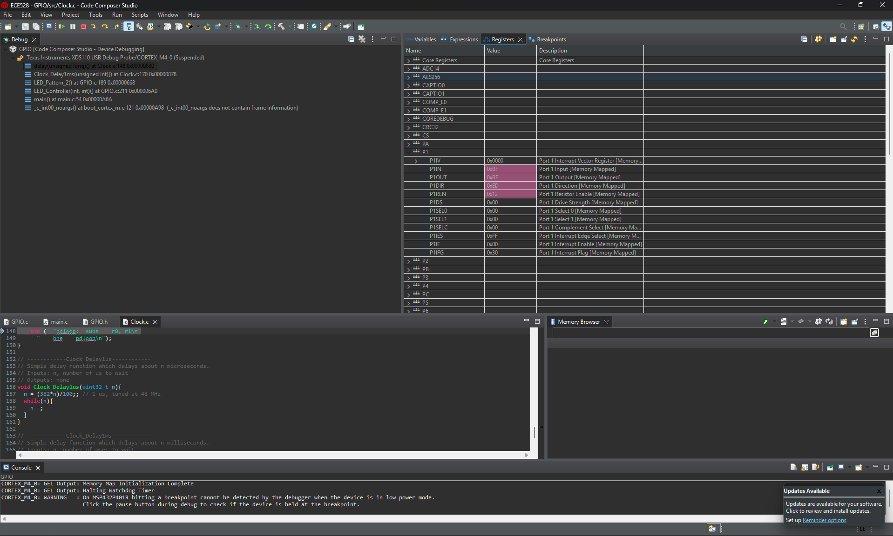
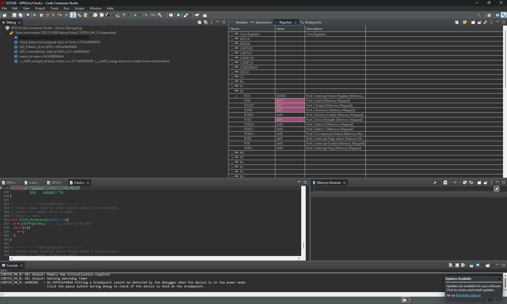
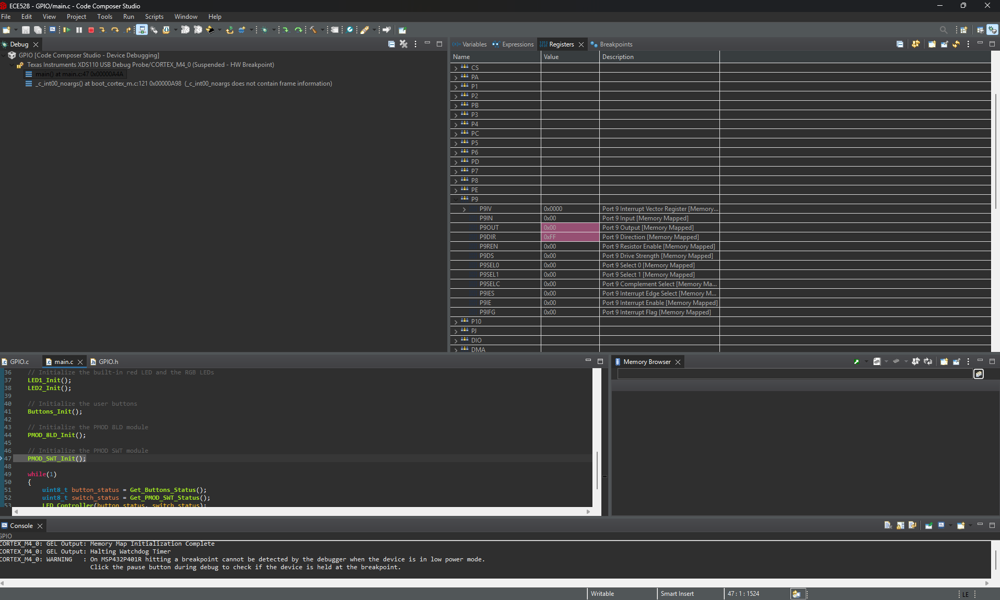
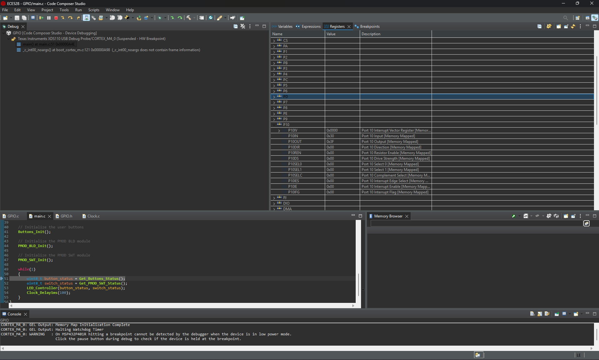

# ECE 528L Lab 0: GPIO

## Overview
 The lab was focused on configuring and using GPIO ports of the MSP432P401R Launchpad. Using the built in buttons, LEDs, PMOD SWT module and PMOD 8LD module using the GPIO registers. Six LED patterns were implemented using The Code Composer Studio for programming the board, writing the code and debugging to observe the registers.
## Components Used
- MSP432P401R LaunchPad
- PMOD 8LD LED module
- PMOD SWT switch module
- Jumper wires
- USB cable
- Code Composer Studio
- Git and GitHub

## Analysis and Results

### Button-Controlled LED Pattern
The built in buttons were used to control LED1, RGB LED, and the PMOD module. Pressing Button 1 turned on LED1 but kept RGB LED off and PMOD LEDs turned on 0,2,4, and 6. Pressing Button 2 turned the RGB led blue but kept LED1 off and PMOD LEDs were set to 1,3,5, and 7. Pressing both buttons caused LED1 and green RGB to flash every second while turning off PMOD LEDs. If no buttons were pressed the onboard LEDs were off and all the PMOD LEDs were on.
### Binary Up Counter
When SWT1 was enabled, LED1 turned on and the RGB LED was set to red. The PMOD 8LD displayed an 8-bit binary counter that counted from 0 to 255 with a 100 ms delay between each value. The sequence stopped after the switch was changed.
### Binary Down Counter
When SWT2 was enabled, LED1 turned on and the RGB LED was set to blue. The PMOD 8LD displayed an 8-bit binary counter that counted from 255 to 0 with a 100 ms delay between each value. The sequence stopped after the switch was changed.
### Left Ring Counter
When SWT3 was enabled, the onboard LEDs turned off. The PMOD pattern began at 0x01 and shifted the active bit to the left every 200 ms until it reached 0x80. Essentially, LED0 to LED7 on the PMOD and continued until the switch was changed.
### Right Ring Counter
When SWT4 was enabled, the onboard LEDs turned off. The PMOD pattern began at 0x80 and shifted the active bit to the right every 200 ms until it reached 0x01. Essentially, LED7 to LED0 on the PMOD and continued until the switch was changed.
### Johnson Counter
When SWT1 and SWT2 were enabled together, LED1 turned on and the RGB LED displayed green. The Johnson counter began with all the PMOD LEDs off. The previous MSB was isolated, inverted, and inserted into bit 0 after the LED pattern shifted to the left. This produced 16 total states which populated all the LEDs then back off in a gradual motion shifting to the left. Each state was displayed every 200 ms.
## GPIO Register Screenshots

### Port 1

### Port 2

### Port 9

### Port 10

## Known Issues or Limitations
- Accidentally forgot a break; in the case statement in LED_Controller() for the Johnson counter that did not cleanly repeat but was fixed
## References
- ECE 528L, Lab 0: General-Purpose Input/Output, Fall 2026.
- ECE 528, Unit 1B: C Programming Review, Fall 2026.
- ECE 528, Unit 2A: GPIO on the MSP432, Fall 2026.
- Texas Instruments, MSP432P401R SimpleLink Mixed-Signal Microcontroller Technical Reference Manual.
- https://www.geeksforgeeks.org/c/bitwise-operators-in-c-cpp/ 
- https://www.w3schools.com/c/c_bitwise_operators.php 
- PMOD SWT (4 Slide Switches) - [Product Link](https://digilent.com/reference/pmod/pmodswt/start)
- PMOD 8LD (8 LEDs) - [Product Link](https://digilent.com/shop/pmod-8ld-eight-high-brightness-leds/)